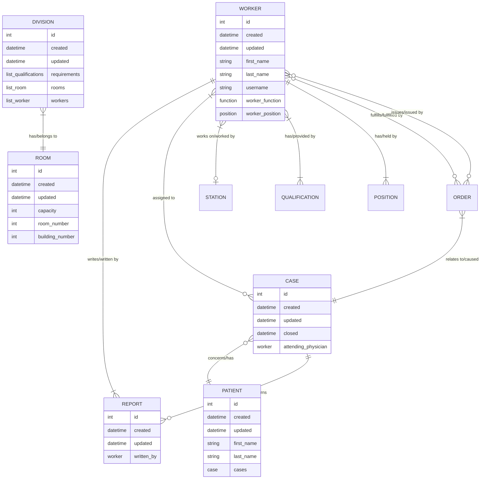
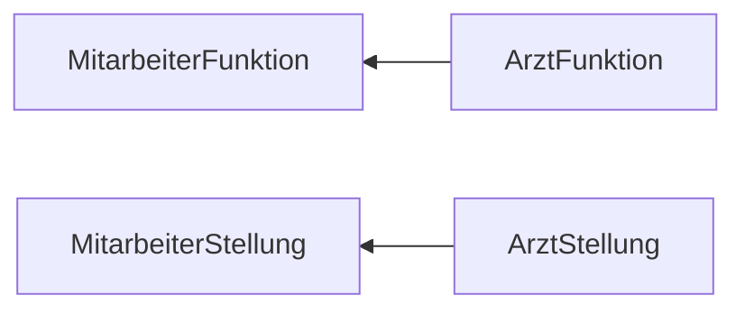

# Objekte der Anschauung

Fehlende Relationen:

- Position, Worker und Station hängen zusammen
- Qualification und Station hängen zusammen
- Order und Case hängen zusammen

## Patient

- Name
- Geburtsdatum
- Adresse
- [Fallhistorie](#Fall)

## Fall

Die Basiseinheit des Prozesses.

- Einlieferungsdatum
- Entlassdatum
- Untersuchungs[berichte](#Report)
- behandelnder Arzt
- weitere Zugriffsberechtigte

## Mitarbeiter

- Name (Vor/Nach)
- Geburtsdatum
- Adresse
- Kann sich einloggen, hat also
    - Username und
    - Password.
- Qualifikation (Fachrichtung)
- Stellung (Hierarchie)
- Arbeitet in einer [Abteilung](#Abteilung).

### Arzt

- Hat Fälle, die er betreut.
- Die Fachrichtung ist relevant für die
    - Berichte, die geschrieben werden können und
    - Stationen auf denen gearbeitet werden kann.
- Die Stellung ist relevant für
    - Zugriffsberechtigungen (in Realität läuft das eher über die Stationsmitgliedschaft),
    - Freigabe von Diagnose[reports](#Report),
    - Weisungsbefugnisse ([Aufträge](#Aufträge)),
    - Entlohnung und Abrechnung (wird ignoriert).

Nur ein Oberarzt oder ein noch höherrangiger Arzt gibt Befunde frei!

Zugriff auf Patientendaten **sollte** laufen **über behandelnden Arzt Status**, läuft **in Realität** aber eher **über Stationsmitgliedschaft**

### Pfleger

- Hat Fälle, die er betreut.

### Labormediziner

- Bekommen [Aufträge](#Aufträge) für Untersuchungen.
- Führen Untersuchungen durch und schreiben [Reports](#Report).

### Transporteur

- Hat **keine** Fälle, die er betreut.

## Report

- Art des Reports
- geschrieben von
- geschrieben am
- betroffener [Fall](#Fall)
- Inhalt
    - unterscheidet sich je nach Art des Reports

### Arten von Reports

- Untersuchungsreport
    - Pathologiereport
    - Radiologiereport
    - Laborreport
- Diagnosereport
    - [ICD](../../Archiv/EGI/Klassifikation%20von%20Krankheiten/ICD.md)-Codes
    - kann sich auf Untersuchung beziehen
- Therapiereport
    - OPS-Codes
    - kann sich auf Diagnose beziehen

Vielleicht auch

- Entlassbrief
    - Freitext
- Arztbrief
    - Freitext

## Abteilung

Ist ein Zusammenschluss von Räumen, mit einer bestimmten Funktion, in der eine Menge von Mitarbeitern arbeitet.

- Bezeichnung
- [Mitarbeiter](#Mitarbeiter)
- [Räume](#Raum)

## Raum

- Funktionsbezeichnung. (Abteilung?)
- Raumnummer.
- Gebäudenummer.
- Kapazität.
- Belegung durch
    - Patienten und/oder
    - Mitarbeiter (?).

## Aufträge

Ärzte können Untersuchungen beauftragen.
Transportaufträge sind potentiell nötig bei Untersuchungen, oder bei Verlegungen.

Aufträge werden erfüllt.

An die Erfüllung kann ein bestimmtes Artefakt geknüpft sein.

- Zeitpunkt der Anforderung
- Erfüllungszeitpunkt
- Art des Auftrags
- betroffener [Fall](#Fall)
- potentiell ein Artefakt

### Arten von Aufträgen

- Behandlungsauftrag
    - sorgt für Vergabe von behandelnder Arzt-Status
- Transportauftrag
    - zieht Raumänderung nach sich
- Untersuchungsauftrag
    - produziert Report
